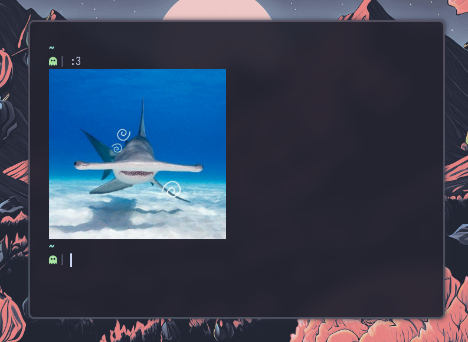

# Blåhaj :3 

  
  <b>🦈blåhaj</b> is a little nix-powered shell script for displaying cute sharks in your terminal using sixel :3
  <blockquote>Try it out for yourself  
  <pre>nix run github:sioodmy/blahaj</pre></blockquote>
  <b>⚠️DMCA:</b> If your work was used in this project against your will, submit an issue and we will remove it (or add you to credits)
     
  <b>🛟Contributing:</b> Just make sure to not mess with copyright laws and credit original authors blablablabla (also each commit message has to end with :3)
  <blockquote>
    >How do i run this on my arch loonix???  
    MY BROTHER IN CHRIST, USE NIX, YOU DONT HAVE TO INSTALL NIXOS TO USE NIX
  </blockquote>

